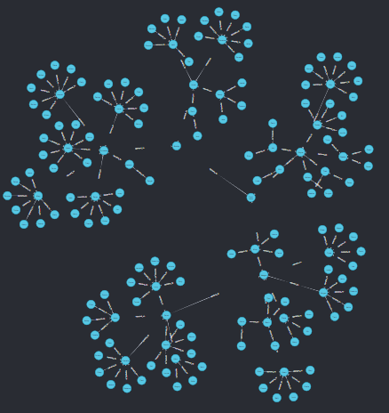
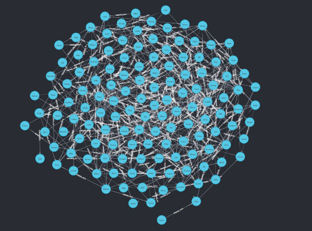

# Neo4j employees

## I. Installation
- Download Neo4j Desktop: https://neo4j.com/download/neo4j-desktop/?edition=desktop&flavour=winstall64&release=1.5.9&offline=true


## II. Initialization
- Open Neo4j Desktop
- Create project: **Employee Project**
- Create DBMS:
    - Name: Employee DBMS
    - Password: *****
    - Version: 5.18.0
- Click "Start DBMS"
    - It creates databases `system` and `neo4j` by default
- Connect to "Employee DBMS"
    - It creates a powershell execution. Close it crashes the connection

## III. Dataset loading
- Open **Neo4j browser**
- Change csv headers

### 1. Load `employees-and-their-boss.csv` file
- Create "employee "`Employee` nodes with first column
```sh
LOAD CSV WITH HEADERS FROM 'https://raw.githubusercontent.com/veben/neo4j_employees/main/resources/employees-and-their-boss.csv'
AS row
CREATE (:Employee {name: row.employee_name})
```
> Added 155 labels, created 155 nodes, set 155 properties, completed after 79 ms.

- Create "boss "`Employee` nodes with second column
```sh
LOAD CSV WITH HEADERS FROM 'https://raw.githubusercontent.com/veben/neo4j_employees/main/resources/employees-and-their-boss.csv'
AS row
MERGE (:Employee {name: row.has_boss})
```
> Added 1 label, created 1 node, set 1 property, completed after 89 ms.

- Look at the inserted nodes
```sh
MATCH (n) RETURN n
```


- Create the relashionships between employees and their boss
```sh
LOAD CSV WITH HEADERS FROM 'https://raw.githubusercontent.com/veben/neo4j_employees/main/resources/employees-and-their-boss.csv'
AS row
MATCH (employee:Employee {name: row.employee_name})
MATCH (boss:Employee {name: row.has_boss})
CREATE (employee)-[:REPORTS_TO]->(boss)
```
> Created 155 relationships, completed after 106 ms.

- Look at the result
```sh
MATCH (n) RETURN n
```


### 1-bis. Load `employees-and-their-boss.csv` file in 1 step (alternative)
> The execution plan for this query contains the Eager operator, which forces all dependent data to be materialized in main memory before proceeding
Using LOAD CSV with a large data set in a query where the execution plan contains the Eager operator could potentially consume a lot of memory and is likely to not perform well. See the Neo4j Manual entry on the Eager operator for more information and hints on how problems could be avoided.

```sh
LOAD CSV WITH HEADERS FROM 'https://raw.githubusercontent.com/veben/neo4j_employees/main/resources/employees-and-their-boss.csv'
AS row
MERGE (employee:Employee {name: row.employee_name})
MERGE (boss:Employee {name: row.has_boss})
WITH employee, boss
WHERE employee.name <> boss.name
MERGE (employee)-[:REPORTS_TO]->(boss)
```
> Added 156 labels, created 156 nodes, set 156 properties, created 155 relationships, completed after 261 ms.

### 2. Load `employees-and-their-friends.csv` file
```sh
LOAD CSV WITH HEADERS FROM 'https://raw.githubusercontent.com/veben/neo4j_employees/main/resources/employees-and-their-friends.csv'
AS row
MERGE (employee:Employee {name: row.employee_name})
MERGE (friend:Employee {name: row.is_friends_with})
WITH employee, friend
WHERE employee.name <> friend.name
MERGE (employee)-[:FRIENDS_WITH]->(friend)
```
> Created 447 relationships, completed after 185 ms.

- Look at the `FRIENDS_WITH` relationships
```sh
MATCH p=()-[:FRIENDS_WITH]->() RETURN p
```


### 3. Clean datbase
```sh
MATCH (n)
DETACH DELETE n;
```

## IV. Querying
### Show a hierarchy of all people working under "Darth Vader"
- Show only pairs
```sh
MATCH (boss:Employee {name: "Darth Vader"})<-[:REPORTS_TO*]-(employee)
RETURN boss, employee
```
- Show the complete path
```sh
MATCH (boss:Employee {name: "Darth Vader"})
MATCH path = (boss)<-[:REPORTS_TO*]-(employee)
RETURN path
```

### Show all the people that work on Jacob’s team, but are not friends with Jacob
- Show all employee directed linked to him (team 1)
```sh
MATCH (jacob:Employee {name: "Jacob"})-[:REPORTS_TO]-(employee)
RETURN jacob, employee AS covorker
```
- Show all employee directed linked to him (team 1 bis)
```sh
MATCH (jacob:Employee {name: "Jacob"})
MATCH (employee)-[:REPORTS_TO]->(jacob)
RETURN jacob, employee AS covorker
UNION
MATCH (jacob:Employee {name: "Jacob"})
MATCH (jacob)-[:REPORTS_TO]->(employee)
RETURN jacob, employee AS covorker
```
- Show all employee directed linked to him (team 2)
```sh
MATCH (jacob:Employee {name: "Jacob"})<-[:REPORTS_TO*]-(employee)
RETURN jacob, employee
```
- Show Jacob's friends
```sh
MATCH (jacob:Employee {name: "Jacob"})-[:FRIENDS_WITH]-(friend)
RETURN jacob, friend
```
- Show Jacob's friends 2
```sh
MATCH (jacob:Employee {name: "Jacob"})
MATCH (friend:Employee)
WHERE friend.name <> "Jacob" AND (friend)-[:FRIENDS_WITH]-(jacob:Employee {name: "Jacob"})
RETURN jacob, friend
```
- Show employees that are not friend with Jacob
```sh
MATCH (jacob:Employee {name: "Jacob"})
MATCH (friend:Employee)
WHERE friend.name <> "Jacob" AND NOT (friend)-[:FRIENDS_WITH]-(jacob:Employee {name: "Jacob"})
RETURN jacob, friend
```
- Final query
```sh
MATCH (jacob:Employee {name: "Jacob"})<-[:REPORTS_TO*]-(employee)
WHERE NOT (jacob)<-[:FRIENDS_WITH]-(employee)
RETURN jacob, employee
```